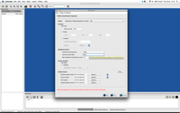
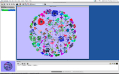

Description of DvDdata is available [here](https://bioconductor.org/packages/release/data/experiment/vignettes/DvDdata/inst/doc/DvDdata.pdf).

Reference Manual from [here](https://bioconductor.org/packages/release/data/experiment/manuals/DvDdata/man/DvDdata.pdf).

To view documentation for the version of this package installed in your system, start R and enter:

```{R}
browseVignettes("DvDdata")
```


## Screenshots

[](../images/dvdClassifyMenu.png)
[](../images/dvdClassifyMenu2.png)
[](../images/dvdContextMenu.png)
[](../images/dvdInputMenu.png)
[](../images/dvdInputMenu.png)
[](../images/dvdNetworkCloseView.png)
[](../images/dvdNetworkCloseView2.png)
[](../images/dvdNetworkOverview.png)
[](../images/dvdNetworkSimpl.png)
